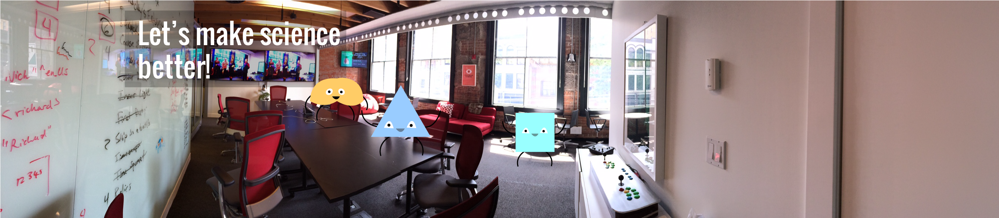
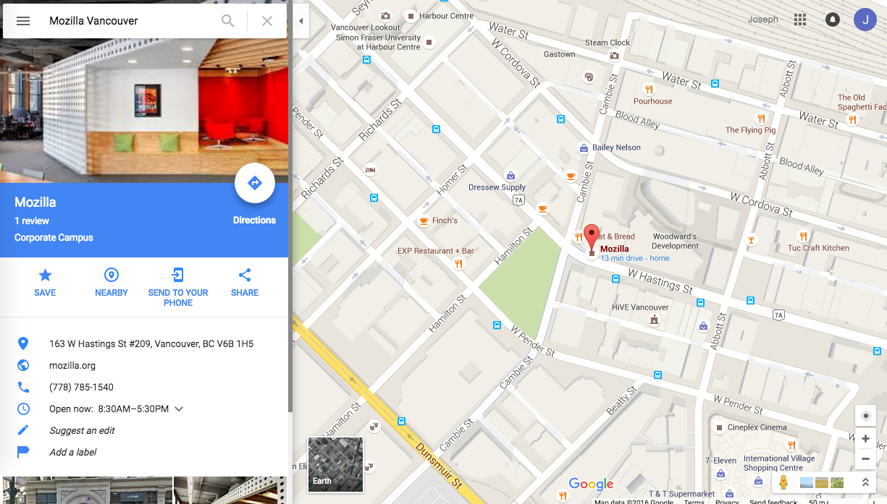

# global-sprint-2016-vancouver

This is the admin repository for the Mozilla Science Lab Global Sprint 2016

## Admin:
Please see the etherpad for the working/living document:  
[https://public.etherpad-mozilla.org/p/global-sprint-2016-vancouver](https://public.etherpad-mozilla.org/p/global-sprint-2016-vancouver)

## What is the Global Sprint?
It is a 2 day “Sprint” in which the Mozilla & open science community - new and old - get together to work collaboratively on projects ranging from tools, citizen science, open educational resources, and open data. 

## Where is the Global Sprint?
There are sites around the world that are hosting the event including a site here in Vancouver at the Mozilla Office downtown. 
Mozilla Vancouver Offices, [163 W Hastings St, Suite 209 Vancouver, BC V6B 1H5 Canada](https://www.google.ca/maps/place/163+W+Hastings+St+%23209,+Vancouver,+BC+V6B+1H5/data=!4m2!3m1!1s0x5486717999142447:0xabeed438dfb06f5c?sa=X&ved=0ahUKEwjOmf_ZjfvMAhVQ3WMKHTCiCfkQ8gEIGzAA)

## When is the Global Sprint?
June 2-3

## Who can participate?
Anyone that is interested in getting involved in an exciting 2 day open science jam! 

## How do I sign up / participate?
The details can be found here:
https://ti.to/mozilla-science/gs2016-vancouver

You can take a list of projects that are taking part of the sprint here:
https://github.com/mozillascience/global-sprint-2016/issues

Or submit your own project that you and others can sprint on together:
https://docs.google.com/forms/d/16M_SiiJkmrkkSONpgd0ERUHLkr1WF4WWXZJIwvurzIs/viewform
